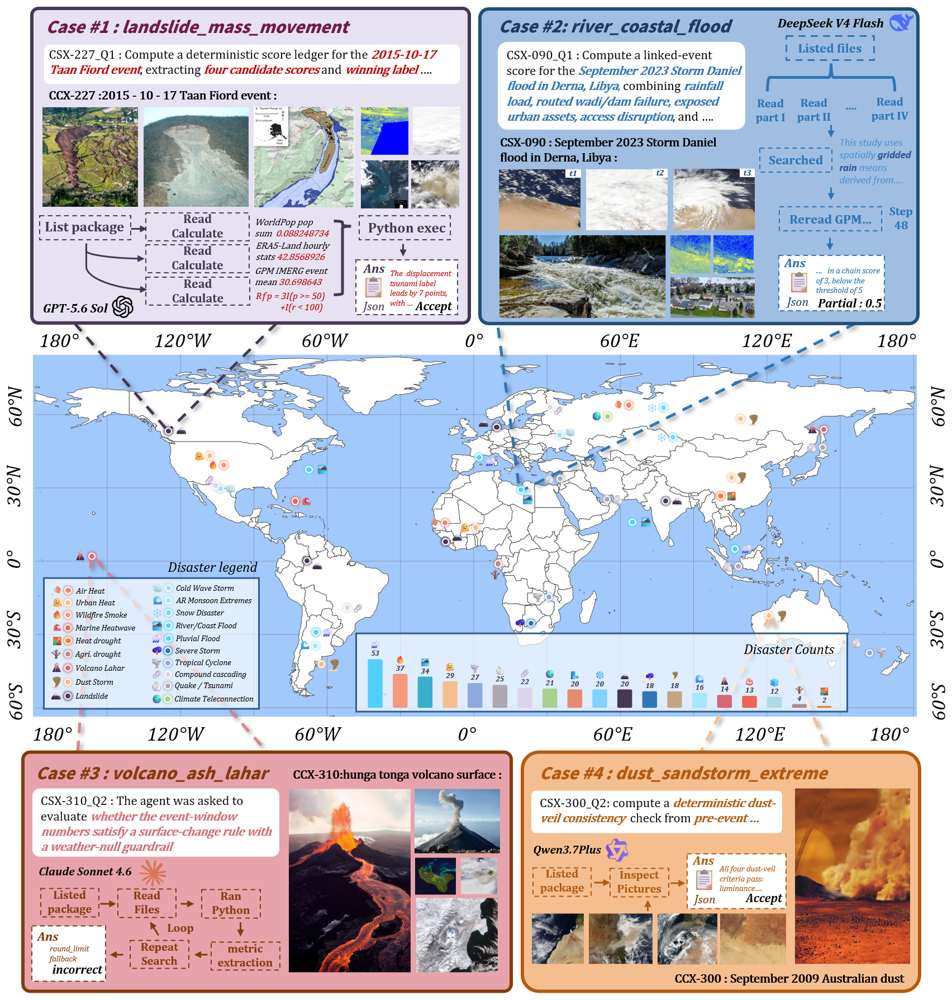
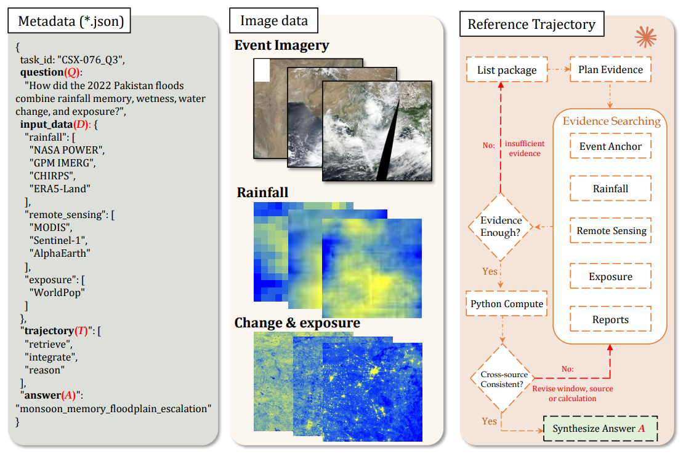

<p align="center">
  
</p>

<p align="center">
  <a href="https://cuizhiq.github.io/EarthVerse/">Project page</a> ·
  <a href="assets/paper/EarthVerse.pdf">Paper</a> ·
  <a href="https://drive.google.com/drive/folders/1Fi4XkTTwwx9B45Egfh7DNt5rYKZHnt26">Download data</a>
</p>

<p align="center">
  
  
  
  
</p>

# EarthVerse

EarthVerse evaluates research agents on 405 questions grounded in 199 documented Earth-system events. Each task combines a scientific question with a package of local evidence, including reports, observations, tables, imagery, rasters, catalogs, and geospatial context. The release covers 19 hazard families and keeps the complete evaluation protocol inspectable: task prompts, agent instructions, scoring prompts, reference answers, structured ground truth, and tool interfaces are all included here.

The event packages are distributed separately because they are too large for GitHub. Download the single public archive from [Google Drive](https://drive.google.com/drive/folders/1Fi4XkTTwwx9B45Egfh7DNt5rYKZHnt26), then extract it at the repository root.

<p align="center">
  
</p>

## What is included

```text
Earth-Verse/
  README.md
  MANIFEST.json
  LICENSE.md
  CITATION.cff
  requirements.txt
  requirements-tools.txt
  assets/
    figures/
    paper/EarthVerse.pdf
  configs/
    evaluation.json
    dimension_schema.json
  scripts/
    run_agent.py
    run_direct.py
    validate_submission.py
    judge.py
    report.py
  integrations/
    earthverse_mcp_server.py
  tools/
    earthverse_tools/
    meteorological_environments/
  task_sets/
    orig405.txt
    dimension_labels.csv
  tasks/
    <task_id>/
      question_en.md
      solution_en.md
      computed_gt.json
  event_packages/                 # supplied by the Google Drive download
    standard_event_packages/
      packages/<event_id>/
        README.md
        data/
        metadata/
```

GitHub contains the evaluation code and task definitions. The Google Drive archive contains the same release plus all 199 event packages. It does not include model runs, experimental notes, construction scripts, caches, or private trajectories.

## Install

EarthVerse requires Python 3.10 or newer.

```bash
git clone https://github.com/CuiZHIQ/Earth-Verse.git
cd Earth-Verse
python -m pip install -r requirements.txt
```

Download `EarthVerse.zip` from Google Drive and extract it here. The resulting data path must be:

```text
event_packages/standard_event_packages/packages/<event_id>/
```

Set your API credentials in the environment:

```bash
export OPENAI_API_KEY="..."
export OPENAI_BASE_URL="https://api.openai.com/v1"
```

The model name, API environment-variable names, runner limits, and output paths live in `configs/evaluation.json`.

## Run the evaluation

```bash
python scripts/run_agent.py \
  --config configs/evaluation.json \
  --task-file task_sets/orig405.txt
```

Each task submission contains a final answer and its execution trajectory:

```text
submission/
  <task_id>/
    answer.md              # required
    trajectory.json        # required
    tool_trace.md          # recommended; required by --strict
    run_notes.md           # recommended; required by --strict
```

Validate and score a run with the same public harness:

```bash
python scripts/validate_submission.py \
  --submission-dir submission \
  --task-file task_sets/orig405.txt \
  --strict

python scripts/judge.py \
  --submission-dir submission \
  --out-dir reports/judge \
  --task-file task_sets/orig405.txt

python scripts/report.py \
  --judge-csv reports/judge/per_task_judge_scores.csv \
  --out-dir reports/final
```

## Scoring

EarthVerse reports two task-level scores on a 0–100 scale:

- `answer_correctness_score` compares the final answer with structured answer units.
- `llm_rubric_score` evaluates evidence use, calculations, reasoning, and task-specific requirements visible in the answer and trajectory.

```text
mean_score = (answer_correctness_score + llm_rubric_score) / 2
```

Strict Accuracy@95 counts a task as correct when its answer-unit score reaches 95. Capability summaries use `task_sets/dimension_labels.csv`. Tool calls, file reads, tokens, latency, and cost remain diagnostics and do not change the official mean score.

## Research tools

The base runner works with `requirements.txt`. Install `requirements-tools.txt` for the wider file, GIS, raster, PDF, and MCP tool set:

```bash
python -m pip install -r requirements-tools.txt
python -m tools.earthverse_tools.cli --list
```

Specialist meteorological environments are defined in `tools/meteorological_environments/environments/`. The MCP server at `integrations/earthverse_mcp_server.py` exposes the same package-scoped inspection and calculation tools to external agent clients.

<p align="center">
  
</p>

## Prompts and evaluator references

`question_en.md` is model-visible. Solvers must not read `solution_en.md` or `computed_gt.json`. The other protocol prompts remain in the source:

- agent prompt: `scripts/run_agent.py::build_initial_messages`
- meteorological environment prompt: `tools/meteorological_environments/agent_entry.py::_tool_instructions`
- judge prompt: `scripts/judge.py::build_messages`

`MANIFEST.json` records the release structure, prompt locations, scoring fields, and download address.

## Citation and license

Use `CITATION.cff` when citing EarthVerse. `LICENSE.md` describes the terms for the code, task annotations, and redistributed evidence.
